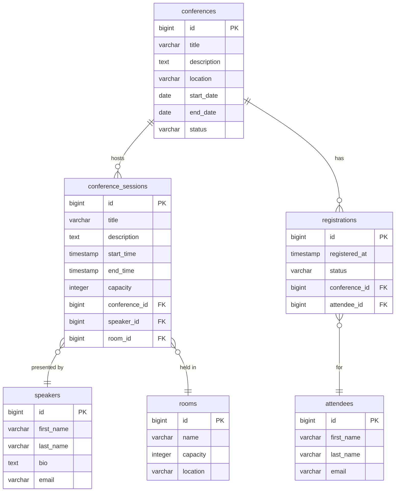

# Brown Events — Architecture Reference

> **Stack**: Spring Boot 2.7.14 · Java 11 · PostgreSQL · Spring Data JPA (Hibernate)  
> **Server**: `localhost:8080`  
> **Base API path**: `/api`

---

## 1. ER Diagram



### Relationship Summary

| Parent | Child | Cardinality | Join Column |
|--------|-------|-------------|-------------|
| `conferences` | `conference_sessions` | one-to-many | `conference_sessions.conference_id` |
| `conferences` | `registrations` | one-to-many | `registrations.conference_id` |
| `speakers` | `conference_sessions` | one-to-many | `conference_sessions.speaker_id` |
| `rooms` | `conference_sessions` | one-to-many | `conference_sessions.room_id` |
| `attendees` | `registrations` | one-to-many | `registrations.attendee_id` |

All associations are `@ManyToOne` / `@OneToMany` — there are no `@ManyToMany` join tables.

---

## 2. Package-to-Responsibility Table

| Package | Layer | Responsibility | Key Classes |
|---------|-------|----------------|-------------|
| `com.brownevents.app` | Bootstrap | Application entry point, CORS configuration, startup data seeding | `BrownEventsApplication`, `WebConfig`, `DataInitializer` |
| `com.brownevents.app.entity` | Domain | JPA entities; each class maps to one DB table; declare all ORM relationships | `Conference`, `Session`, `Speaker`, `Attendee`, `Room`, `Registration` |
| `com.brownevents.app.repository` | Persistence | Spring Data JPA repositories; provide CRUD + custom query methods; only layer that touches the DB | `ConferenceRepository`, `SessionRepository`, `RegistrationRepository`, `AttendeeRepository`, `SpeakerRepository`, `RoomRepository` |
| `com.brownevents.app.service` | Business logic | Orchestrate repository calls; enforce business rules (e.g. attendee upsert, registration ownership check) | `ConferenceService`, `RegistrationService`, `SessionService`, `SpeakerService` |
| `com.brownevents.app.controller` | API | `@RestController` beans; parse HTTP requests, delegate to services, build HTTP responses | `ConferenceController`, `RegistrationController`, `SessionController`, `SpeakerController` |

### Repository Custom Methods

| Repository | Custom Method | SQL Equivalent |
|------------|---------------|----------------|
| `AttendeeRepository` | `findByEmail(String email)` | `SELECT * FROM attendees WHERE email = ?` |
| `RegistrationRepository` | `findByConferenceId(Long id)` | `SELECT * FROM registrations WHERE conference_id = ?` |
| `RegistrationRepository` | `existsByIdAndConferenceId(Long id, Long confId)` | `SELECT EXISTS(... WHERE id = ? AND conference_id = ?)` |
| `SessionRepository` | `findByConferenceId(Long id)` | `SELECT * FROM conference_sessions WHERE conference_id = ?` |

---

## 3. Controller → Service → Repository Call Chains

### Flow 1 — Create Conference

```
POST /api/conferences
  Body: { title, description, location, startDate, endDate, status }

  ConferenceController.createConference(Conference)
  └─ ConferenceService.createConference(Conference)
     └─ ConferenceRepository.save(conference)
        → INSERT INTO conferences (...)
  → 200 Conference
```

**Files**:
- `controller/ConferenceController.java` — `createConference()`
- `service/ConferenceService.java` — `createConference()`
- `repository/ConferenceRepository.java` — inherited `save()`

---

### Flow 2 — Register Attendee

The attendee is **upserted** by email before the registration is created.

```
POST /api/conferences/{id}/register
  Body: { firstName, lastName, email }

  RegistrationController.registerAttendee(conferenceId, Attendee)
  └─ RegistrationService.registerAttendee(conferenceId, Attendee)
     ├─ AttendeeRepository.findByEmail(email)
     │    → SELECT * FROM attendees WHERE email = ?
     ├─ [if absent] AttendeeRepository.save(attendee)
     │    → INSERT INTO attendees (...)
     ├─ ConferenceRepository.findById(conferenceId).get()
     │    → SELECT * FROM conferences WHERE id = ?
     └─ RegistrationRepository.save(registration)
          → INSERT INTO registrations (status='CONFIRMED', registered_at=now(), ...)
  → 200 { "data": Registration }
```

**Files**:
- `controller/RegistrationController.java` — `registerAttendee()`
- `service/RegistrationService.java` — `registerAttendee()`
- `repository/AttendeeRepository.java`, `ConferenceRepository.java`, `RegistrationRepository.java`

---

### Flow 3 — List Sessions for a Conference

```
GET /api/conferences/{id}/sessions

  ConferenceController.getConferenceSessions(id)
  └─ ConferenceService.getConferenceSessions(id)
     └─ SessionRepository.findByConferenceId(id)
          → SELECT * FROM conference_sessions WHERE conference_id = ?
  → 200 { "data": [Session, ...] }
```

**Files**:
- `controller/ConferenceController.java` — `getConferenceSessions()`
- `service/ConferenceService.java` — `getConferenceSessions()`
- `repository/SessionRepository.java` — `findByConferenceId()`

---

### Flow 4 — Create Session under a Conference

```
POST /api/conferences/{id}/sessions
  Body: { title, description, startTime, endTime, capacity, speaker:{id}, room:{id} }

  ConferenceController.createSession(conferenceId, Session)
  └─ ConferenceService.createSession(conferenceId, Session)
     ├─ ConferenceRepository.findById(conferenceId).get()
     │    → SELECT * FROM conferences WHERE id = ?
     └─ SessionRepository.save(session)
          → INSERT INTO conference_sessions (conference_id = conferenceId, ...)
  → 200 { "data": Session }
```

**Files**:
- `controller/ConferenceController.java` — `createSession()`
- `service/ConferenceService.java` — `createSession()`
- `repository/ConferenceRepository.java`, `SessionRepository.java`

---

### Flow 5 — Update Session

```
PUT /api/sessions/{id}
  Body: { title, description, startTime, endTime, capacity, speaker:{id}, room:{id} }

  SessionController.updateSession(id, Session)
  └─ SessionService.updateSession(id, Session)
     ├─ SessionRepository.findById(id).get()
     │    → SELECT * FROM conference_sessions WHERE id = ?
     │    (merges title, description, startTime, endTime, capacity, speaker, room)
     └─ SessionRepository.save(existing)
          → UPDATE conference_sessions SET ... WHERE id = ?
  → 200 Session
```

**Files**:
- `controller/SessionController.java` — `updateSession()`
- `service/SessionService.java` — `updateSession()`
- `repository/SessionRepository.java` — inherited `findById()` / `save()`

---

### Flow 6 — Cancel (Delete) a Registration

```
DELETE /api/conferences/{id}/registrations/{registrationId}

  RegistrationController.deleteRegistration(conferenceId, registrationId)
  └─ RegistrationService.deleteRegistration(conferenceId, registrationId)
     ├─ RegistrationRepository.existsByIdAndConferenceId(registrationId, conferenceId)
     │    → SELECT EXISTS(...) [throws IllegalArgumentException if false]
     └─ RegistrationRepository.deleteById(registrationId)
          → DELETE FROM registrations WHERE id = ?
  → 204 No Content
```

**Files**:
- `controller/RegistrationController.java` — `deleteRegistration()`
- `service/RegistrationService.java` — `deleteRegistration()`
- `repository/RegistrationRepository.java` — `existsByIdAndConferenceId()`, inherited `deleteById()`

---

## 4. REST API Surface

| Method | Path | Description |
|--------|------|-------------|
| `GET` | `/api/conferences` | List all conferences |
| `POST` | `/api/conferences` | Create a conference |
| `GET` | `/api/conferences/{id}` | Get one conference |
| `PUT` | `/api/conferences/{id}` | Update a conference |
| `GET` | `/api/conferences/{id}/sessions` | List sessions for a conference |
| `POST` | `/api/conferences/{id}/sessions` | Add a session to a conference |
| `POST` | `/api/conferences/{id}/register` | Register an attendee (upserts attendee by email) |
| `GET` | `/api/conferences/{id}/registrations` | List registrations for a conference |
| `DELETE` | `/api/conferences/{id}/registrations/{rid}` | Cancel a registration |
| `GET` | `/api/sessions/{id}` | Get one session |
| `PUT` | `/api/sessions/{id}` | Update a session |
| `GET` | `/api/speakers` | List all speakers |
| `POST` | `/api/speakers` | Create a speaker |

> **Note**: `Room` has no controller endpoints — rooms are pre-seeded by `DataInitializer` and referenced by ID in session payloads.

---

## 5. Frontend Architecture

> **Stack**: React 18 · React Router v6 · Vite 4 · plain CSS (no UI library, no TypeScript)  
> **Dev server**: `localhost:3000`  
> **Production**: nginx static file server + `/api/` reverse proxy to backend

---

### 5.1 Directory Structure

```
frontend/src/
├── main.jsx          # ReactDOM.createRoot entry point
├── App.jsx           # BrowserRouter + route table
├── api.js            # All fetch calls to the backend (single source of truth)
├── index.css         # Full design system — CSS custom properties + all component styles
├── pages/
│   ├── ConferenceListPage.jsx     # "/" — conference grid + inline "New Conference" modal
│   ├── ConferenceDetailPage.jsx   # "/conferences/:id" — sessions, registrations, inline register modal
│   ├── SessionDetailPage.jsx      # "/conferences/:id/sessions/:sessionId" — session detail
│   └── RegistrationPage.jsx       # "/conferences/:id/register" — standalone register form
└── components/
    ├── ConferenceCard.jsx          # Single conference card used in the list grid
    ├── SessionList.jsx             # Renders a list of SessionCard items
    ├── SessionCard.jsx             # Clickable session card
    └── SessionMeta.jsx             # Time / room / capacity / speaker row + "View Details" link
```

---

### 5.2 Route Table

| Path | Page | Notes |
|------|------|-------|
| `/` | `ConferenceListPage` | Conference grid; "New Conference" opens an inline modal |
| `/conferences/:id` | `ConferenceDetailPage` | Sessions list, registrations table, inline register modal |
| `/conferences/:id/sessions/:sessionId` | `SessionDetailPage` | Full session detail |
| `/conferences/:id/register` | `RegistrationPage` | Standalone register form (lighter than the modal) |

Client-side routing uses `BrowserRouter`; nginx serves `index.html` as the fallback for all non-asset paths (`try_files $uri $uri/ /index.html`).

---

### 5.3 State Management

There is no global state library. Every page manages its own data with `useState` + `useEffect` for fetching. There is no shared context or store — data is fetched fresh on each page mount.

---

### 5.4 API Layer (`frontend/src/api.js`)

All backend communication is centralised in a single module. It uses the native `fetch` API. `BASE_URL` is hardcoded to `http://localhost:8080` — change this or use `import.meta.env.VITE_API_URL` for non-local deployments.

| Function | Method | Backend Endpoint |
|----------|--------|-----------------|
| `getConferences()` | GET | `/api/conferences` |
| `getConference(id)` | GET | `/api/conferences/:id` |
| `createConference(data)` | POST | `/api/conferences` |
| `getConferenceSessions(id)` | GET | `/api/conferences/:id/sessions` |
| `getSession(id)` | GET | `/api/sessions/:id` |
| `getSpeakers()` | GET | `/api/speakers` |
| `getConferenceRegistrations(id)` | GET | `/api/conferences/:id/registrations` |
| `registerAttendee(confId, data)` | POST | `/api/conferences/:confId/register` |
| `deleteRegistration(confId, regId)` | DELETE | `/api/conferences/:confId/registrations/:regId` |

> **Note**: Several functions do `data.data || data` to handle inconsistent response shapes from the backend (some endpoints wrap in `{ "data": ... }`, others return the entity directly).

---

### 5.5 Frontend → Backend Request Flow

```
User interaction (click / form submit)
    |
    v
Page component (useState, useEffect)
    |
    v
api.js function  ──── fetch() ────►  Spring Boot REST API (localhost:8080)
    |                                        |
    ◄─────────── JSON response ─────────────┘
    |
    v
setState → re-render
```

In development, Vite also proxies `/api/*` to `http://localhost:8080` via `vite.config.js`, but this is redundant because `api.js` already uses an absolute base URL.

---

### 5.6 Build and Deployment

| Environment | How it runs |
|---|---|
| **Development** | `npm run dev` (from `frontend/`) — Vite dev server on port 3000 with HMR |
| **Production (Docker)** | Multi-stage Dockerfile: Node 18 Alpine builds `dist/`, then nginx Alpine serves it |
| **nginx proxy** | `/api/` → `http://backend:8080/api/` (Docker Compose service name); all other paths → `index.html` |

**Fonts** (loaded via Google Fonts in `index.html`): Bebas Neue (display headings), Lora (body serif), Space Mono (labels/metadata).

---
